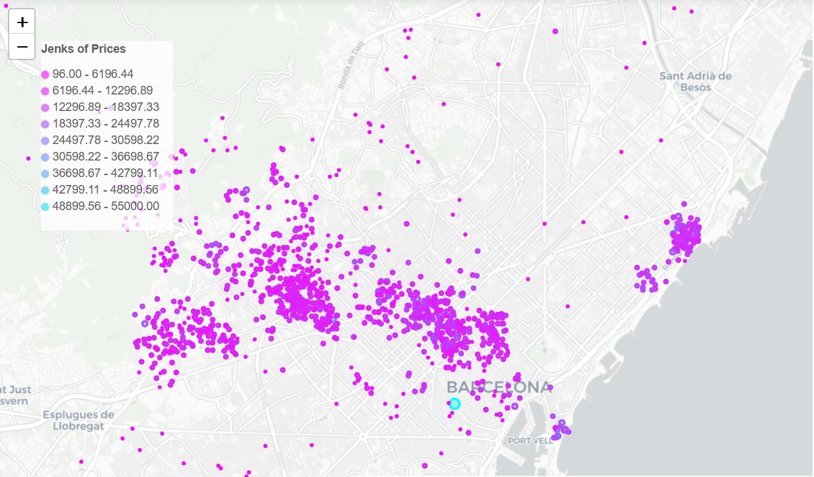
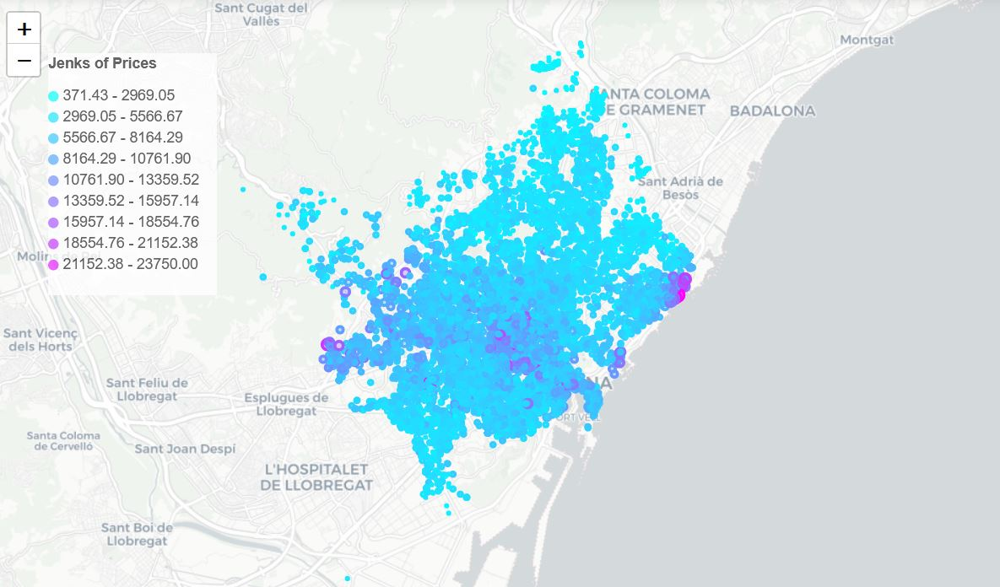
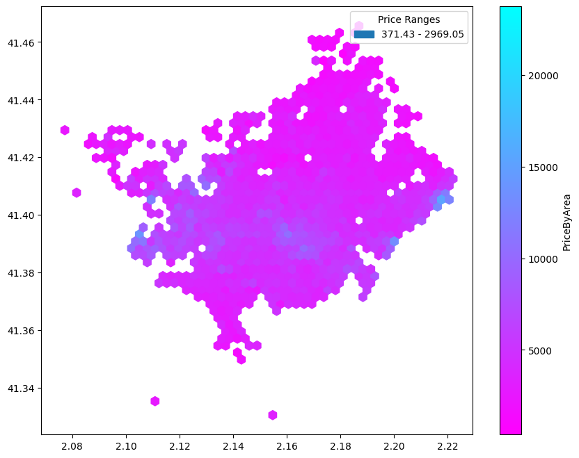

# Data science for real estate
## Built Heritage vs Real Estate Market. The Barcelona case 
[BLog link](https://blog.iaac.net/correlation-of-heritage-and-real-estate-barcelona-case/)
Data science project in Python  
tools: Jupyter Notebook, Python,  Idealista API  +  Pandas +  Geopandas +  Numpy +  Folium + BeautifulSoup + OSMNX + Matplotlib + Plotly + Networks + PyTorch.
## Questions
- How official status of built heritage affects real estate prices?
- How correlation could be identified geographically?
- What is the difference between correlations of oficially listed built heritage or old buildings over 50 years with real estate prices?
## What I learned: 
- Idealista API for query of real estate lots
- Geographical distribution of data by natural jenks
- Geographical distribution of data by hexagon histogram
- Measuring regions the Spatial lag
- Clustering maps by K-Means
- Merging and overlapping maps built from different datasets for correlation insights
## Key takeaways
- spatial affect of built heritage spreads within isochrones of 10-munites walk from listed heritage buildings
- strong correlation observed not only between the real estate cost and alone standing heritage buildings but also between the real estate cost and historical neighborhoods that include not-listed old buildings.
- the spatial lag reveals clustering of neighborhoods by mean sale price
## video presentation

## methodology
1. Evaluate the best way of creating a real estate prices dataset by testing API and scraping approaches, finally get a dataset with sufficient data entries. [source>>](DS3_FIN_11.ipynb)
2. Calculate the price per sqm for each data entry in the real estate prices dataset.
3. Match the real estate prices dataset with the Barcelona neighborhood shapefile, calculate mean, max, min, and average price per sqm.
4. Fetch heritage points and polygons from OpenStreetMap, create isochrones of them at 100, 400, and 800 meters.
5. Fetch buildings data from the public cadastre, categorize them by heritage-like and not (already 50 years old buildings could fit the built heritage policy requirements), cluster buildings, make buffers of 400m, match the amount of heritage-like buildings with the Barcelona neighborhood shapefile.
6. Make a correlation between mean, max, min, and average price per sqm and heritage buffer zones, heritage-like buffer zones.
7. Evaluate the hypothesis, check the data on conditions of heritage buildings in non-correlated zones.
## data visualization
### Map representing geographical distribution of listings retrieved by Idealista API and aggregated by natural jenks

### Map representing geographical distribution of listings retrieved by ready dataset sourced from Fotocasa and aggregated by natural jenks

### Hexagon histogram from the previous geodataset

## References
- OpenStreetMap: [OpenStreetMap](https://www.openstreetmap.org)
- Institut Cartogràfic i Geològic de Catalunya: [ICGC](http://www.icgc.cat)
- Public Cadastre of Spain: [Cadastre](https://www.sedecatastro.gob.es/)
- Idealista.es – Spain's #1 Real Estate Web Portal: [Idealista](https://www.idealista.es)
- Fotocasa.es – Spain's #2 Real Estate Web Portal: [Fotocasa](https://www.fotocasa.es)
