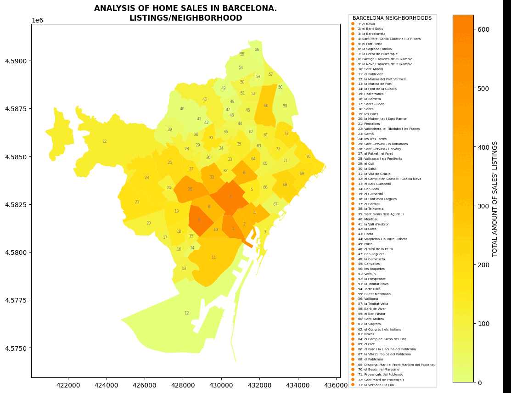
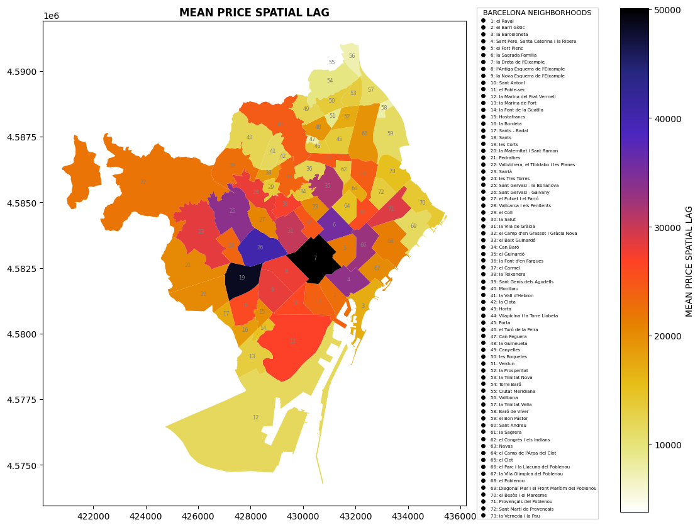
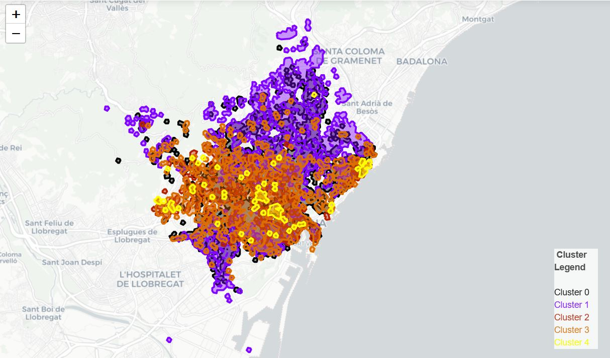
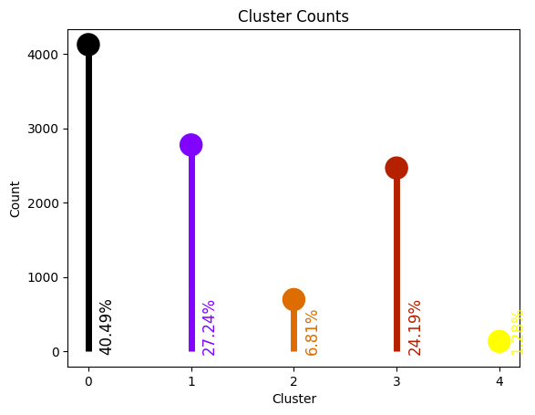
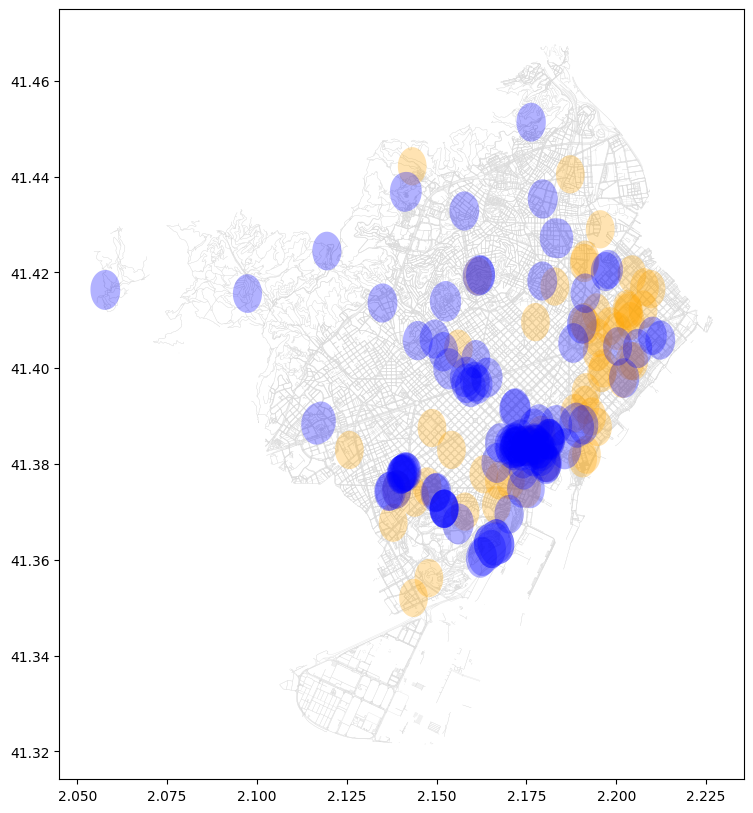
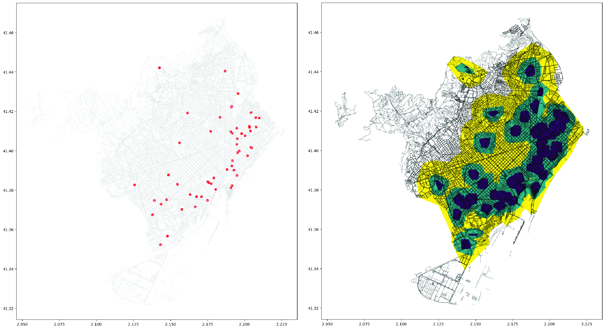
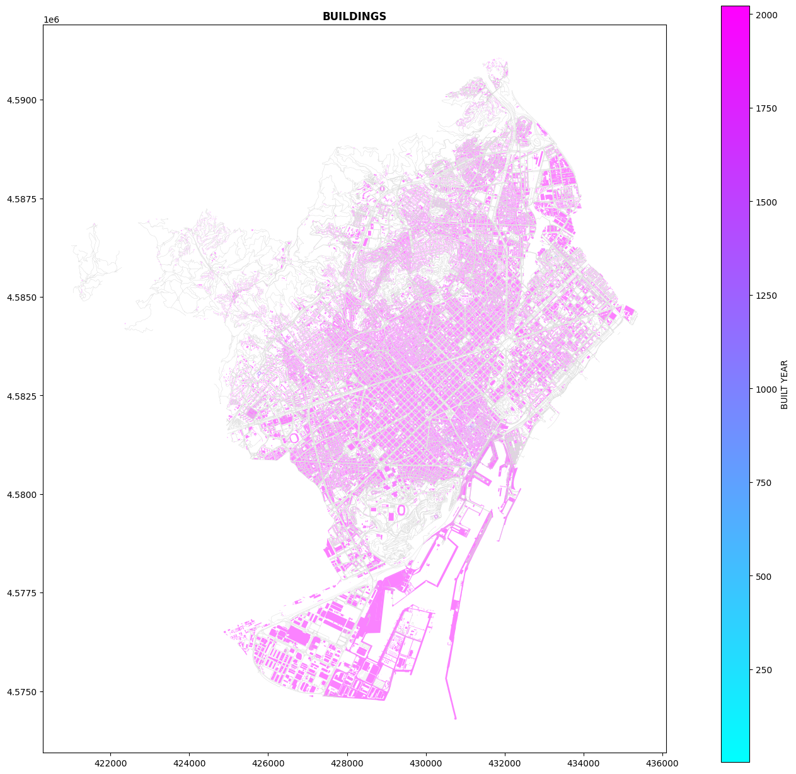
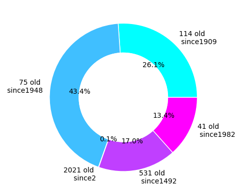
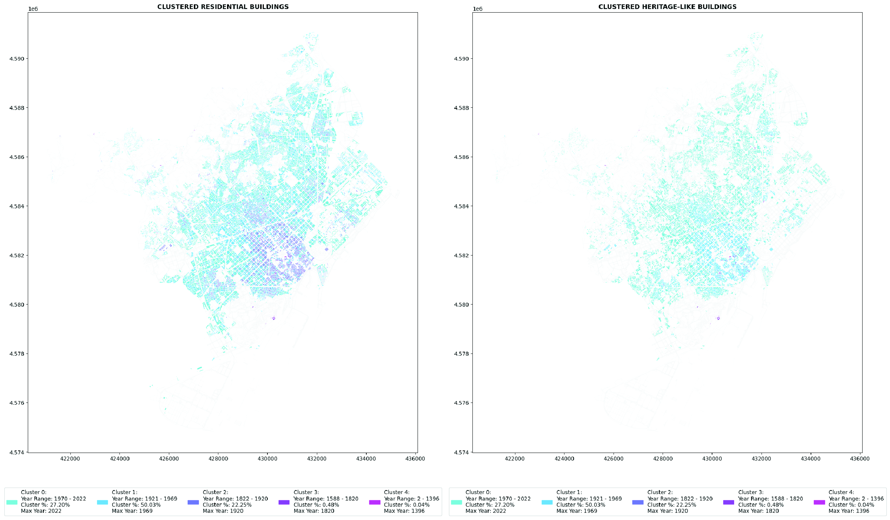
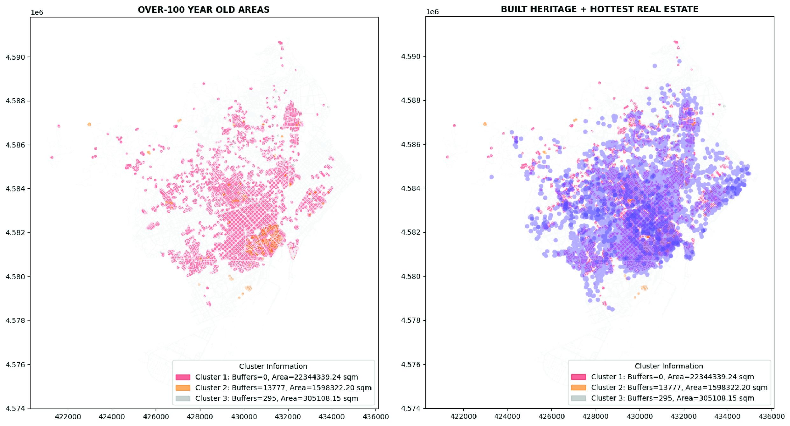

# Data science for real estate
## Built Heritage vs Real Estate Market. The Barcelona case 
[BLog link](https://blog.iaac.net/correlation-of-heritage-and-real-estate-barcelona-case/) 
Data science project in Python  
tools: Jupyter Notebook, Python,  Idealista API  +  Pandas +  Geopandas +  Numpy +  Folium + BeautifulSoup + OSMNX + Matplotlib + Plotly + Networkx + Scikit-learn.
## Questions
- How official status of built heritage affects real estate prices?
- How correlation could be identified geographically?
- What is the difference between correlations of oficially listed built heritage or old buildings over 50 years with real estate prices?
## What I learned: 
- Idealista API for query of real estate lots
- Geographical distribution of data by natural jenks
- Geographical distribution of data by hexagon histogram
- Make comprehensive maps with Folium
- Measuring regions the Spatial lag
- Clustering maps by K-Means
- Merging and overlapping maps built from different datasets for correlation insights
## Key takeaways
- spatial affect of built heritage spreads within isochrones of 10-munites walk from listed heritage buildings
- strong correlation observed not only between the real estate cost and alone standing heritage buildings but also between the real estate cost and historical neighborhoods that include not-listed old buildings.
- the spatial lag reveals the highest demand for real estate in neighborhoods La Dreta and Les Cortes.
- 50% of all residential buildings in Barcelona were built between 1920-1970s, and together with more oldest 22% they combine the 72% cogort of buildings older 50 years.
## video presentation

## methodology
1. Evaluate the best way of data mining in order to get sufficent data for analysis. [source>>](DS3_FIN_11.ipynb)
2. Calculate the price per sqm for each data entry in the real estate prices dataset.[source>>](DS3_FIN_11.ipynb)
3. Match the real estate prices dataset with the Barcelona neighborhood shapefile, calculate mean, max, min, and average price per sqm. [source>>](DS3_FIN_2+3.ipynb)
4. Fetch heritage points and polygons from OpenStreetMap, create isochrones of them at 100, 400, and 800 meters. [source>>](DS3_FIN_4.ipynb)
5. Fetch buildings data from the public cadastre, categorize them by heritage-like and not (already 50 years old buildings could fit the built heritage policy requirements), cluster buildings, make buffers of 400m, match the amount of heritage-like buildings with the Barcelona neighborhood shapefile. [source>>](DS3_FIN_4.ipynb)
6. Make a correlation between mean, max, min, and average price per sqm and heritage buffer zones, heritage-like buffer zones. [source>>](DS3_FIN_5+6.ipynb)
7. Evaluate the hypothesis, check the data on conditions of heritage buildings in non-correlated zones. [source>>](DS3_FIN_5+6.ipynb)
## data visualization
### Map representing geographical distribution of listings retrieved by Idealista API and aggregated by natural jenks

### Map representing geographical distribution of listings retrieved by ready dataset sourced from Fotocasa and aggregated by natural jenks

### Hexagon histogram from the previous geodataset

### GIF Map visualization of the merged dataset of listings and Barcelona neighborhoods showing amount of listings, minimum, maximum, average, mean, medium prices.

### Map data visualization of the spatial lag of mean prices by neighborhoods of Barcelona.
 
### Map of data visualization of listings clustered by price. K-means by Scikit-learn

### Lollipop graph of clusters.

### Map data visualization of overlapping ORANGE 100-m buffers around [osm heritage amentites](https://wiki.openstreetmap.org/wiki/Key:heritage) and BLUE 2 heighest clusters of listings.

### Map data visualization of 5 - 10 - 20 min isochrones around [osm heritage amentites](https://wiki.openstreetmap.org/wiki/Key:heritage).

### Map data visualization the histogram range by the mean apartment price within heritage 10-min isochrone areas.

### Map data visualization the buildings footprints clustered by 5 ranges of construction years.

### Donut chart of 5 clusters of buildings in Barcelona by age.

### Map data visualization representing 5-age clustering the all residential and heritage-listed buildings.

### Map data visualization of overlapping datasets of over-100-years-old buildings and 10-min walkability isochrones of 2 heighest price range clusters of listings.

## References
- OpenStreetMap: [OpenStreetMap](https://www.openstreetmap.org)
- Institut Cartogràfic i Geològic de Catalunya: [ICGC](http://www.icgc.cat)
- Public Cadastre of Spain: [Cadastre](https://www.sedecatastro.gob.es/)
- Idealista.es – Spain's #1 Real Estate Web Portal: [Idealista](https://www.idealista.es)
- Fotocasa.es – Spain's #2 Real Estate Web Portal: [Fotocasa](https://www.fotocasa.es)
